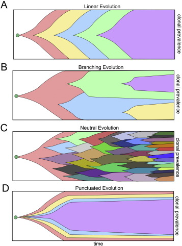
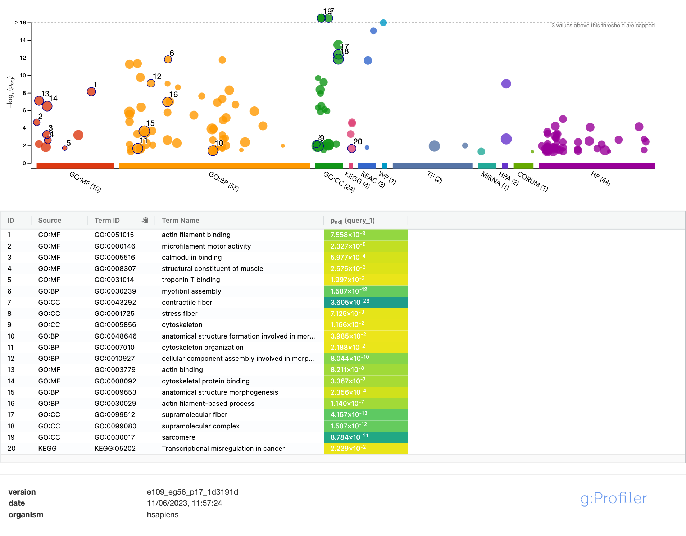
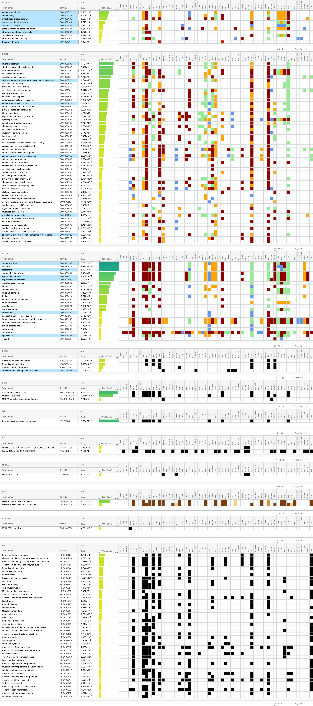
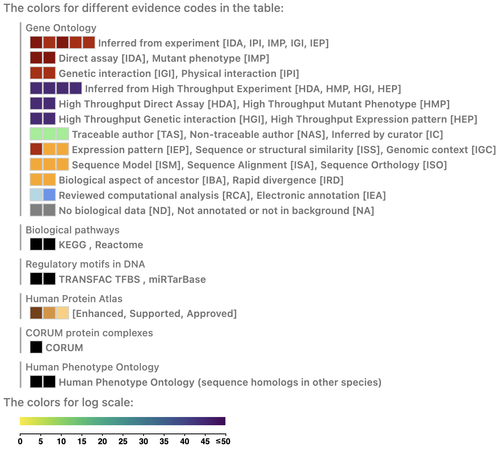

# Introduction

## Rationale

Intratumoral heterogeneity is one of the main causes of why targeted therapies, despite being quite promising from a theoretical point of view,
end up in untreatable and multiresistant relapses in patients. The study of cancer evolution has brough scientists to the conclusion that the intratumoral
heterogeneity can assume different forms, and is more often than not a mixture of pre-existing and acquired features.



Recently, the punctuated evolution and the neutral evolution models have been appointed as the ones reflecting tumor heterogeneity the most, and have been confirmed on over
30% of TCGA Dataset. According to these models, a short burst of clones in the beginnig can turn into the expansion of some, and the co-existence of several branches at the same time.
Also, the predominat clone can result either from the short, initial burst, or from subsequently generated heterogeneity.

Heterogeneity can have different forms. The most widely observed is genetic heterogeneity, altough it  only explains a small part of how  tumor progresses in patients. The concept of the existence of persister cells,
 displaying non-genetic heterogeneity, is now something accepted and widely demonstrated - [Huang S. et al](https://doi.org/10.1038/nrg2556). Since the large-scale diffusion of RNAsequencing 
technologies, a wide number of transcriptional classifiers have been investigated, as to try to predict, based on differential gene expression, the potential patient outcome or some features of the tumor.
Among the most robust classifiers, we find examples such as the CRIS classifier for colorectal cancer - [Isella et al.](https://doi.org/10.1038/ncomms15107) -, or PAM-50 classifier for 
breast 
cancer -  [Parker, J. S. et al.](https://doi.org/10.1200/jco.2008.18.1370).

Thanks to scRNAseq approaches, the occurrence of heterogeneusly classified cells inside the same tumor has been demonstrated.
Combination of genetic, non genetic, aquired or pre-existing heterogeneity can give rise to a multitude of phenotypes, each with its own specific feature. However, another major source of
intratumoral dishomogeneity can be appointed to features related to ECM and microenvironment components as well.


## ECM heterogeneity
### Its role in the tumoral landscape

Composition, posttranslational modifications, and organization of the ECM are dynamically regulated. Cells sense
the biochemical and mechanical properties of the ECM through
specialized transmembrane receptors that include integrins, discoidin domain receptors (DDRs), and syndecans.ECM composition, density, organization, and posttranslational modifications
including cleavage and cross-linking dictate the material property or viscoelasticity, e.g., stiffness of the stroma. Biochemical and mechanical properties
of the ECM exquisitely tune the growth, survival, migration, invasion, and differentiation of cells within the tissue to influence their
fate and regulate tissue development, phenotype, and homeostasis. As a confirm of the importance of the characteristics of the ECM components, in most cancer types we can find some form of alteration of 
in organization or mechanical properties of ECM. This can lead to inflamation, fibroblast expansion and activation, angiogenesis disregulation and a stiff and crosslinked tumor stroma.

All of these processes directly regulate tumor ability to grow, disseminate, extravasate and, eventually, metastatize.
For example, a stiffened ECM has been related to a mechanical stress on the tumor cells which, while potentially interfering with tumor growth, increases the mechanical stress which in turn promotes EMT and  a  dysfunctional vasculature  which facilitates intravasation [Leventhal et al,](http://refhub.elsevier.com/S1534-5807(19)30237-0/sref62)[Neve et al.](http://refhub.elsevier.com/S1534-5807(19)30237-0/sref77)
The way in which this ECM disregulation happens are not yet fully understood. While several research focus on how cancer cells can directly influence tumoral microenvironment and EMT by  secretion of proteins, the ability of ECM to signal and modify transcriptional profile of cells has to be taken into account as well.
To support such observations, we find  in literature many classifiers, which allow patient stratification through  molecular classifiers in which  different subsets can be discriminated 
according o EMT related differentially expressed genes, such as the one published by [Peng Y. et al.](https://doi.org/10.3389%2Ffimmu.2021.666137)

Taking into account ECM features during the therapy decision making process, or even directly targetting ECM features could be new frontiers  in cancer treatment. However, this requires a more in-depth investigation of regulation of ECM  subtypes and the relative modulators, other than observing how intratumoral ECM heterogeneity contributes to the global characteristics of the tumor.


## STIFmap project

In breast cancer, a stron g correlation has been found between extracellular matrix stiffening and invasiveness and aggressiveness of tumor. [Acerbi I. et al.](https://doi.org/10.1039/c5ib00040h)
Nevertheless, classification of stiff regions in tumor samples proves to be difficult due to the elevated heterogeneity among the samples.

A general method to measure stiffness is the use of  nanoscale Atomic Force Microscopy (AFM), a technique which measures elasticity of collagen fiber  thanks to the measuremet of the occurring forces between  the tip of the probe and the sample, calculated according to the tip deflection.

The analyzed dataset is part of a project carried out by UCSC surgery department, directed by Valerie M. Weaver with the collaboration of Stashko C. and Northey J.
Under the direction of Weaver V. surgery department, 3 patients with breast cancer had their tumor collected and analyzed with STIFmap, a convolutional neural network.

Spatially Transformed Inferential Force Map (STIFMap) exploits computer vision to precisely automate atomic force microscopy (AFM) indentation combined with a trained convolutional neural network to predict stromal elasticity with micron-resolution using collagen morphological features and ground truth AFM data.

With this kind of technology, stromal stiffness can be measured and quantified on in-vivo tumors, investigating tumoral heterogeneity and the relationship with tumoral progression, in a 
visual way.

Classified tumor tissue was then collected and  engrafted on a Patient Derived Xenograph (PDX).
In this way, informations about tumor stiffness could be compared  to RNAsequencing data, as to identify potential markers and features which could explain the observed differences from a molecular point of view, while also taking into account the intratumoral heterogeneity of each patient.

Resources and project description can also be found [here](https://www.ncbi.nlm.nih.gov/geo/query/acc.cgi).

# Dataset features

## Description

The GSE179983 dataset is available on [Gene Expression Omnibus (GEO)](https://www.ncbi.nlm.nih.gov/geo/query/acc.cgi?acc=GSE179983) database. It's a serie of 18 human derived samples, engrafted into PDX.
From each of the 3 patients enrolled in the STIFmap project at UCSC Weaver Lab, both stiff and soft tumor samples were collected, as to mantain the intratumoral heterogeneity features. Samples coming from the same patient but with different stromal composition were each split into 3 groups, as to generate 3 replicates, and each replicate was engrafted in a PDX, for a total of 6 PDX for patient, half with stiff stromal composition and half with a soft one.

The resulting 18 samples are part of the [GPL24676 platform](https://www.ncbi.nlm.nih.gov/geo/query/acc.cgi?acc=GPL24676), meaning they all were sequenced by High throughput Illumina NovaSeq 
6000 for human samples, during the year 2018.
RNAseq fastq files were mapped to the primary assembly of the Gencode v33 human genome using Rsubread (version 2.0.1) and counted using featureCounts, with Genome_build:hs33.
RNA was isolated using TRIzol (Invitrogen, Cat. : 15596018) followed by chloroform extraction. RNAseq library preparation and sequencing was performed by the Vincent J. Coates Genomics Sequencing Laboratory, University of California, Berkeley. Samples were sequenced in NovaSeq 6000 S4 lanes with 150bp paired-end reads with approximately 25 million read pairs per sample
Dataset is available as a raw count matrix, without any information regarding transcript length.

It can be downloaded and inspected as follows

## Download and inspection

The file can be downloaded to be submitted to the pipeline by following instructions on the (Initialization script)[]

First, dataset is downloaded and unzipped

```{r eval=FALSE}
setwd("Dataset/")
system("wget https://ftp.ncbi.nlm.nih.gov/geo/series/GSE179nnn/GSE179983/suppl/GSE179983_pdx_hs33_counts.txt.gz")
system("gunzip GSE179983_pdx_hs33_counts.txt.gz")
setwd("../")
```

This is required only when importing the dataset the first time and if the Dataset folder has not yet been downloaded. For this reason, in the script these lines have been commented

```{r}
cat(system("head Dataset/GSE179983_pdx_hs33_counts.txt",intern=TRUE),sep ='\n')
```

As we can see, the raw data counts are distribuited in 18 columns of a csv file. First column contains versioned Ensembl id of genes,first row contains the sample name. Column names correspond 
to BAM file names of each samples but are not representative of sample annotations.
Annotations for each sample can be obtained from the collecion of [BioSamples accessions](https://www.ncbi.nlm.nih.gov/biosample?LinkName=bioproject_biosample_all&from_uid=746133) on NCBI database, for which a 
[summary](https://github.com/CBenetti/Data_Analysis_exam/blob/main/Dataset/GSE179983_biosample.txt) has been downloaded in txt format

```{r}
cat(system("head Dataset/GSE179983_biosample.txt",intern=TRUE),sep ='\n')
```

We can see here as each patient is associated to a tumor (tumor 1,2 or 3),each sample is either classified as stiff or soft, to annotate the results from STIFmap analysis, and different 
replicates are present for each patient tumor type.

## Dataset processing

As to procede into further analysis of the data, the dataeset must be loaded into R environment, annotations should be integrated in a was as to match the original sample set, gene names 
attribuited to each Ensembl id, and counts normalized. Each of these results is produced by sourcing the [import script](https://github.com/CBenetti/Data_Analysis_exam/blob/main/Scripts/01_import.R) from the main folder in R.

```{r}
source("Scripts/01_import.R")
```

The starting point is the DataFrame ds, loaded in R environment as

```{r}
ds <- read.table("Dataset/GSE179983_pdx_hs33_counts.txt", sep=",", header=T, row.names=1)
dim(ds)
head(ds)

```
The raw count table is to be considered a Dataframe with 18 columns and 60721 rowns, corresponding to the 18 samples and with a total of 60721 mapped ids.

To assign annotation to each sample, the following code is used to read lines of the annotation file, match the sample name to the correct line, and then deconstruct it to get
information about the patient, the stromal stiffnes and the replicate.

```{r}
##phenoData annotation
        
pd <- readLines("Dataset/GSE179983_biosample.txt")
pd<-pd[seq(1,90,5)]
tumor <- unlist(lapply(pd,function(x){strsplit(strsplit(x,"Breast ")[[1]][2],", ")[[1]][1]}))
tumor <- gsub(" ","",tumor)
stroma <- unlist(lapply(pd,function(x){strsplit(strsplit(x,", ")[[1]][2]," gel")[[1]][1]}))
tmp <- unlist(lapply(pd,function(x){gsub("\\]","",strsplit(x,", ")[[1]][3])}))
name <- unlist(lapply(tmp, function(x){strsplit(x," \\[")[[1]][2]}))
rep <- unlist(lapply(tmp, function(x){strsplit(x," \\[")[[1]][1]}))
phenoD <- data.frame(stroma=factor(stroma),patient=factor(tumor),replicate=factor(rep))
rownames(phenoD) <- name
colnames(ds) <- unlist(lapply(colnames(ds),function(x){strsplit(x,"\\.")[[1]][1]}))
phenoD <- phenoD[colnames(ds),]
phenoD
```
We can see that now, annotations match the sample names in the column of the dataframe

```{r}
colnames(ds)
```
### Recovery of Gene names

This is important to allow the correct interpretation of the final results. Converting each Ensembl id into gene names is possible thanks to the Bioconductor package 
[ensembldb](https://bioconductor.org/packages/release/bioc/html/ensembldb.html),
in which a filter framework can be used to retrieve annotations from Ensembl database. To download the correct version of the Ensembldb, the package 
[AnnotationHub](https://bioconductor.org/packages/release/bioc/html/AnnotationHub.html) was used.
The genome build used to map fastq files was Gencode v33, which corresponds to [GRCh38.p13](https://www.gencodegenes.org/human/release_33.html) assembly.

According to [Ensembl assembly specifics](https://www.ensembl.org/info/website/archives/assembly.html), GRCh38.p13 is covered by Ensembl versions spanning from 98 to 109. V99 was chosen for this 
project. 

All of the packages required for the analysis are already installed in the docker, as per the instructions on the 
[Dockerfile](https://github.com/CBenetti/Data_Analysis_exam/blob/main/Docker/Dockerfile).
Informations on how to build, download or use the docker can be found on the [Docker](https://github.com/CBenetti/Data_Analysis_exam/tree/main/Docker) folder on github, and more detailed 
instructions are provided in the relative [README.md](https://github.com/CBenetti/Data_Analysis_exam/blob/main/Docker/README.md) file.

With the following code, after the library loading the download of the Ensembldb takes place. Since the download is done automatically inside the R cache folder, this has to be created first, 
acoording to the architecture in use.

```{r}
library(ensembldb)
library(AnnotationHub)
#Download an annotation version compatible with Genome assembly hs33
        if(!file.exists(getAnnotationHubOption("CACHE"))){
                here<-getwd()
                setwd("~")
                home <- unlist(strsplit(getwd(),"/"))
                obj <- unlist(strsplit(getAnnotationHubOption("CACHE"),"/"))
                abs <- obj[which(match(obj,home, nomatch=0)==0)]
                for(i in 1:length(abs)){dir<-paste(abs[c(1:i)],collapse="/");if(!file.exists(dir)){dir.create(dir)}}
                setwd(here)
        }
        ah <- AnnotationHub()
        ahDb <- query(ah, pattern = c("Homo Sapiens", "EnsDb", 99))
        ahEdb <- ahDb[[1]]

genes(ahEdb)

```
The genes() function can be used to visualize the fields of the object. Our main fields of interest are the gene_id_version, which corresponds to the versioned Ensembl ids provided in the raw 
data table, symbols and gene_biotype.

>**NOTE** When downloading the database for the first time, it might require some time. To shorten the rendering time, sourcing code 01_import.R before rendering would allow to retrieve the files from cache when executing the render() function

Usually, the query of the ahEdb objec is done through filtering for de-versioned id. However, since here we dispose of versioned ids, which have the advantage of being univoque, an 
alternative 
procedure was put in place to obtain information directly from gene_id_version, altough it isn't available as a filter. Also, we should consider that the ahEdb object is not a dataframe, and 
thus it should not be subsetted as such.
First, we check whether there are any unmapped ids.

```{r}
rownames(ds)[which(match(rownames(ds),genes(ahEdb)$gene_id_version,nomatch=0)==0)]
```
Unmatching ids are related to ids for which _PAR_Y suffix was applied.
According to Ensembl database, the IDs with  _PAR_Y suffix do not exist, but they seem to be related to pseudoautosoomal genes, thus genes related to X and Y chromosomes, which can be aligned to 
both as a result of their proximity to crossing over hotspots. By defaul, in ensembldb such genes are aligned to X chromosome. As a matter of fact, ids without the suffix are already present in 
the geneset and can be ascribed to regions on the X chromosomes.

```{r}
        tmp <- unlist(lapply(rownames(ds)[which(match(rownames(ds),genes(ahEdb)$gene_id_version,nomatch=0)==0)],function(x){strsplit(x,"_")[[1]][1]}))
        tmp%in%rownames(ds)
```
As to not completely exclude them from the analysis, symbols are assigned on the base of the X aligned id, excluding the suffix from the query for the subset of unmatching genes 

```{r}
        Tx <- vector(length=length(rownames(ds)))
        biotype <- vector(length=length(rownames(ds)))
        names(Tx) <- rownames(ds)
        names(biotype) <- rownames(ds)
        
        #Assigning symbols for Id's which match
        main <- genes(ahEdb)[which(match(genes(ahEdb)$gene_id_version,rownames(ds)[which(match(rownames(ds),genes(ahEdb)$gene_id_version,nomatch=0)>0)],nomatch=0)>0)]
        ids <- as.vector(main$gene_id_version)
        sym <- as.vector(main$symbol)
        Tx[ids] <- sym
        bio <- as.vector(main$gene_biotype)
        biotype[ids] <- bio
        
        #Assigning symbols for IDs which don't
        main <- genes(ahEdb)[which(match(genes(ahEdb)$gene_id_version,tmp,nomatch=0)>0)]
        ids <- as.vector(main$gene_id_version)
        sym <- as.vector(main$symbol)
        sym <- unlist(lapply(sym, function(x){paste(c(x,"_PAR_Y"),collapse="")}))
	ids <- unlist(lapply(ids, function(x){paste(c(x,"_PAR_Y"),collapse="")}))
        Tx[ids] <- sym
        bio <- as.vector(main$gene_biotype)
        biotype[ids] <- bio
        names(biotype) <- NULL
        names(Tx)<- NULL
```

At this point, Tx contains the gene symbols associated to the ensemblids in the rownames of the dataset

```{r}
head(Tx)
head(rownames(ds))
```

To identify the presence of duplicated genes, the following lines of code retrieve the position of duplicated symbols and uses the corresponding ids to retrieve information on said genes, which 
is then saved. in this way, we can procede with the analysis with the totality of the genes, and only filtering them out in case they appear as differentially expressed.

```{r}
        #Info on duplicated symbols
        dup <- Tx[which(duplicated(Tx)==TRUE)]
        info_on_duplicated_id <- genes(ahEdb)[which(match(genes(ahEdb)$gene_id_version,rownames(ds)[ which(Tx%in%dup ==TRUE)],nomatch=0)>0),]
        save(info_on_duplicated_id,file="Results/Duplicated_id_info.rda")

length(Tx[which(duplicated(Tx)==TRUE)])
head(info_on_duplicated_id)
```
As we can see, duplicated genes are only 34, and they mainly display differences in the starting or ending position

### ExpressionSet initialization

The ExpressionSet to be submitted for further analyis was initialized with [Biobase](http://bioconductor.org/packages/release/bioc/html/Biobase.html) tools.
A total of 3 Expressionset objects were built, one for the raw counts, one for the cpm normalized counts and one for the log2 normalized counts, obtained as follows

```{r}
library(edgeR)
counts <- cpm(ds)
logcounts <- cpm(ds,prior.count=1,log=TRUE)
```
The final object is a list of ExpressionSets, each`with the same number of rowns and columns of the original dataset, and annotated with phenoData containing information on the stroma, the patient 
and the replicate identifier, and featureData with ene names and de-versioned Ensembl ids.

```{r}
library(Biobase)

        minimalSet <- ExpressionSet(assayData=as.matrix(ds))
        phenoData(minimalSet) <- new("AnnotatedDataFrame",data=phenoD)
        featureData(minimalSet) <- new("AnnotatedDataFrame",data=data.frame(Geneid=Tx, Biotype=biotype))
        counts <- cpm(ds)
        logcounts <- log(counts+1,2)
        countset <- ExpressionSet(assayData=as.matrix(counts))
        phenoData(countset) <- new("AnnotatedDataFrame",data=phenoD)
        featureData(countset) <- new("AnnotatedDataFrame",data=data.frame(Geneid=Tx,Biotype=biotype))
        logc <- ExpressionSet(assayData=as.matrix(logcounts))
        phenoData(logc) <- new("AnnotatedDataFrame",data=phenoD)
        featureData(logc) <- new("AnnotatedDataFrame",data=data.frame(Geneid=Tx,Biotype=biotype))


        GSE179983 <- list(minimal = minimalSet,count = countset, log = logc)
	save(GSE179983, file="Dataset/GSE179983.rda")	

GSE179983$count
pData(GSE179983$count)
dim(fData(GSE179983$count))
head(fData(GSE179983$count))
```
With this set of data, it is possible to procede to the analyisis on the differential gene expression between samples with different stromal stiffness and evaluate the impact of intratumoral 
heterogeneity on the results.

# Results

The overall design of the analysis involves a differential expression analysis between stromal stiff and stromal soft tumors, in order to understand whether there is any driver or effector which 
triggers or has been triggered from the different environments in which cells are embedded. A biological investigation of the results completes the picture, as to investigate biological 
processes which may be involved in the differential stromal composition, but also to evaluate if our experimental design had any biological coherence at all.
Results for each step of the analysis were saved as pdf images in the [Results](https://github.com/CBenetti/Data_Analysis_exam/tree/main/Results) folder in the Github repository, by means of pdf 
calling before plot generation in each of the R script.

>**Example**
```{r eval=FALSE}
pdf("Results/plot.pdf")

#image or plot generation

dev.off()
```

## Data visualization and dimensional reduction

Since we are considering an expressionset with more than 60000 features, dimensional reduction is required to visualize the data and allow to make observations on the dataset before performing 
any analysis. For this reason, a comparison between a pca and tsne plot seemed as the most reasonable approach.
Analysis can be run by sourcing [02_dimensional_reduction_plot.R](https://github.com/CBenetti/Data_Analysis_exam/blob/main/Scripts/02_dimensional_reduction_plot.R) file from the 
Data_analysis_exam folder.

```{r}
source("Scripts/02_dimensional_reduction_plot.R")
```

### PCA

PCA is the most informative dimensonal reduction technique, allowing to make observations according on the amount of variance explained by each of the components. In this kind of graph, the 
spread along the axis with the higher variance explained is representative of the highest source of variability between samples. We can hence try to propose a biological interpretation on the 
basis of the annotation data associated to each sample.

For the analysis, the [prcomp](https://www.rdocumentation.org/packages/stats/versions/3.6.2/topics/prcomp) function is used, and since it's already present in the R base pool of functions, 
no additional package has to be loaded from our library.

The expressionset in use for the dimenctional reduction refers to normalized and logaritmic form of the data, as per the requirements of the function. Data must be transposed, as we want to 
perform reduction on genes, as to represent each sample as a point in a bidimensional space. This is true for both tsne and pca.

```{r eval=FALSE}
library(Biobase)
load("Dataset/GSE179983.rda")
```
```{r}
pca <- prcomp(t(exprs(GSE179983$log)))
```

From the Scree plot of the explained variance, we understand how much variance is explained by each component. A succesful PCA should have an exponential decrease in the variance explained by 
each successive component.

```{r}
x <- factor(colnames(summary(pca)$importance), levels=colnames(summary(pca)$importance))
barplot(summary(pca)$importance[2,]*100,names.arg=x, las=2, ylab="Variance proportion (%)", main="Scree plot", col="darkcyan")
```

From this Scree plot, a significative reduction of explained variance can be observed, with little to no variance explained after PC10. The amount of variance explained by ther first principal 
component however does not reach 40%, suggesting a somehow complex picture.

```{r fig.height=9, fig.width=9}
plot(pca$x[,1],pca$x[,2], col=pData(GSE179983$log)$stroma,pch=c(rep(16,6),rep(17,6),rep(18,6)),xlab=paste(c("PC 1",summary(pca)$importance[2,1]*100,"%"),collapse=" "), ylab =paste(c("PC 2",summary(pca)$importance[2,2]*100,"%"),collapse=" "), main="PCA GSE179983")
legend("top",col=c(rep(1,3),rep(2,3)),pch=rep(c(17,18,16),2), legend = c("Tumor 1, soft","Tumor 2, soft","Tumor 3, soft","Tumor 1, stiff","Tumor 2, stiff","Tumor 3, stiff"))
```

The plot provides functional annotations regarding the stromal type and the patient from which samples were collected.
There is a distinct separations between samples from patient 3 and all others, suggesting this patient could hold some heterogeneity features which distingush him from all others. Also, the 
biggest separation occurs for a couple of stromal stiff samples, either pointing them out as outliers or due to a greater similarity in the mechanisms in which stromal stiffnes was achieved.
Overall, no clear separation between stromal stiff and stromal soft sample could be observed.

### tsne

To better focus on the grouping and similarities within samples, tsne dimensional reduction was employed. Rtsne packege for R is required
In this case, we cannot get informations on how the variance is spread, however we can have a greater insight on how much samples are similar between each other.
To exclude variability associated to random number generation, seed was randomly set to allow for reproducibility.
Perplexity, the abiliy of a tsne to try and capture the bigger picture behind the distribution of the data, was set to 5, as the optimal range for perplexity should be between 5 and 50, and 
given the low dimensionality of our dataset, 5 is close to the maximum perplexity allowed for the system.

```{r fig.height=9,fig.width=9}
set.seed(666)
tsne <- Rtsne(t(exprs(GSE179983$log)), perplexity=5)
plot(tsne$Y[,1],tsne$Y[,2], col=pData(GSE179983$log)$stroma,pch=c(rep(16,6),rep(17,6),rep(18,6)),xlab="tsne1", ylab ="tsne2", main="tsne GSE179983")
legend("top",col=c(rep(1,3),rep(2,3)),pch=rep(c(17,18,16),2), legend = c("Tumor 1, soft","Tumor 2, soft","Tumor 3, soft","Tumor 1, stiff","Tumor 2, stiff","Tumor 3, stiff"))
```

In tsne, we can see better how samples tend to cluster according to the patient, rather than for the stromal composition. Again, patient 1 and 2 seem to share more similarty as they are 
closer, however with tsne we better evaluate similarity than distance, so we have no information on how different are elements which are more distant. Again, two samples from stromal stiff 
tumors of patient 1 and 2 seem to display a closer similarity.
With tsne, we can also observe how within each cluster, some sort of separation between stromal stiff and soft tumors exists. However, differences among patients seem to prevaricate over 
differences in stromal stiffness. Thus, when performing differential expression analysis, these things should be accounted for in the design formula.

## Differential expression analysis

Diffrential expression can be performed by sourcing [03_differential_expression.R](https://github.com/CBenetti/Data_Analysis_exam/blob/main/Scripts/03_differential_expression.R).

### Differential gene expression

For the differential expression analysis, [DESeq2](http://bioconductor.org/packages/devel/bioc/vignettes/DESeq2/inst/doc/DESeq2.html) package is used. During a differential 
expression analysis, differentially expressed genes are found according to a glm 
model. In this case, the model has to take into account both the condition of interest (stromal stiffnes vs stromal softness) and the patient from which the sample has been collected, to 
account from batch effect due to the patient.

For this kind of analysis, the raw data format is required, since the function already filters and normalized the data by setting a minimum level of expression and normalizing for sequencing 
depth (lib.size).

```{r}
###library
        library(edgeR)
        library(Biobase)
	library(DESeq2)
	dds <- DESeqDataSetFromMatrix(countData = exprs(GSE179983$minimal), colData = data.frame(condition=pData(GSE179983$minimal)$stroma,group=pData(GSE179983$minimal)$patient),design = ~ group + condition )
```
The first step is to create a DESeq2 object, which is fit for the analyisis. In this object, we also specify the formula of the design. In the formula, group stands for the patient of 
appartenence. Putting this term as first, as suggested by DESeq2 guidelines, allows to build a background encompassing all the differences between each patient and than creating a baseline. 
The second term is the the condition of interest. In the Expressionset structure, pData was already initialized as a factor, which is the form in which these annotations should be used in 
the formula, to be used in a logistic regression.

The DESeq2 object is then used for the analysis.

```{r}
        res <- DESeq(dds)
	summary(results(res))
```
Result of the analysis is a set of genes, for which LogFC and padj has been computed. A positive LogFC, according from the experimental design, corresponds to genes which are more expressed 
by the stromal stiff samples than from the soft stromal samples.
From the summary of the results, we see that only 5 of the genes have a negative LogFC. The overall mean expression is <3, meaning the mayority of genes has a relatively low expression. 43% 
of genes was already filtered for displaying a low cout, while 2% were considered as outliers. Genes with a positive LogFC and a pvalue < 0.1 were approximately 1.3% 

Criteria for filtering have been developed also on the basis of the distribution of the logFC over the gene mean expression values. Genes which have an expression of 0 or close to it, 
display an high LogFC in function of the fact that dividing by zero in a logaritm provides very high value, in spite of an actual significative differential expression. 

```{r fig.height=8, fig.width=8}
        plot(results(res)$baseMean[which(results(res)$padj<0.05)],results(res)$log2FoldChange[which(results(res)$padj<0.05)],xlab="Mean expression",ylab="log2FC",main="Singnificative genes (padj < 0.05)")
```

From the distribution of genes with a padj < 0.05, we see that all of the genes have a LogFC > 0. We also see that most of them have a mean expression close to 0.

```{r fig.height=8, fig.width=8}
	plot(results(res)$baseMean[which(results(res)$padj<0.05)],results(res)$log2FoldChange[which(results(res)$padj<0.05)],xlim=c(0,1000),xlab="Mean expression",ylab="log2FC",main="Singnificative genes (padj < 0.05)")
        abline(v=quantile(results(res)$baseMean,seq(0,1,0.05))[20], col="blue")
        abline(v=quantile(results(res)$baseMean,seq(0,1,0.05))[18], col="yellow")
        abline(v=quantile(results(res)$baseMean,seq(0,1,0.05))[17], col="green")
        abline(v=quantile(results(res)$baseMean,seq(0,1,0.05))[16], col="red")
        legend("top","left",pch=16,col=c("blue","yellow","green","red"),legend=c("90%","85%","80%","75%"))
```

Zooming in the region close to 0, we can better see the distribution of the genes. Different cutoffs can be chosen according to the distribution of the mean around different quantiles. 75% 
percentile seems as the most conservative choice but strict enough as to be able to exclude genes with mean too close to 0.  

According to this distribution, genes with LogFC>3, padj<0.05 and mean expression higher than 75 percentile were considered as differentially expressed

```{r}
        higher_in_stiff <- rownames(results(res))[which(results(res)$padj < 0.05 & results(res)$log2FoldChange > 3 & results(res)$baseMean>quantile(results(res)$baseMean,probs=seq(0,1,0.05))[16])]
        red <- exprs(GSE179983$log)[higher_in_stiff,]
        hstiff <- fData(GSE179983$log)$Geneid[which(match(rownames(exprs(GSE179983$log)),higher_in_stiff,nomatch=0)>0)]
```

We can than make sure that among the differentially expressed genes there are none of those with duplicated symbols

```{r}
unique(unlist(info_on_duplicated_id$symbol))%in%hstiff
```

Also, none of the differentially expressed gene is among the list of pseudoautosomal genes.

```{r}
tmp <- unlist(lapply(rownames(ds)[which(match(rownames(ds),genes(ahEdb)$gene_id_version,nomatch=0)==0)],function(x){strsplit(x,"_")[[1]][1]}))
tmp%in%hstiff
``` 

### Results interpretation

By using only the differentially expressed genes to perform a dimensional reduction of the data, the improvement on separation between stromal stiff and soft samples can be investigated. For 
this reason, a tsne was used, with a perplexity of 4 since the dimensionality of the data was now further reduced. Again, a seed was set as to remove variability appointed to the random 
initialization of the procedure.


```{r fig.height=8, fig.width=8}
set.seed(9999)
       tsne <- Rtsne(t(red),perplexity=4)
       plot(tsne$Y[,1],tsne$Y[,2], col=pData(GSE179983$log)$stroma,pch=c(rep(16,6),rep(17,6),rep(18,6)),xlab="tsne1", ylab ="tsne2", main="tsne GSE179983")
       legend("bottom",col=c(rep(1,3),rep(2,3)),pch=rep(c(17,18,16),2), legend = c("Tumor 1, soft","Tumor 2, soft","Tumor 3, soft","Tumor 1, stiff","Tumor 2, stiff","Tumor 3, stiff"))
```

The results do not improve the separation between stromal and stiff samples, with the exception of a small subgroup of samples from patient 1 and 2. Separation of samples from patient 3 is 
still evident enough.
This could suggest that a lot of heterogeneity occurs among the cells in each condition and in each patient.

To further look into this hypotesis, an heatmap is built for a better visualization of the results, comparing differentially expressed genes of stromal stiff and soft samples.
Heatmap is built by visualizing log expression of the genes on mean log expression ratio. To genes more expressed than the mean we assign red colors, while the opposite is true for genes 
with expression lower than the mean.

```{r fig.width=10, fig.height=13}
	library(circlize)
        library(ComplexHeatmap)
	heat <- t(apply(exprs(GSE179983$log),1,function(x){x-mean(x)}))
        toc <- pData(GSE179983$log)
        toc <- toc[order(toc$patient),]
        toc <- toc[order(toc$stroma),]
        heat <- heat[,rownames(toc)]
        col_fun <- colorRamp2(c(-2, 0, 2), c("blue", "white", "red"))
        ha = rowAnnotation( genes=anno_text(hstiff, gp = gpar(fontsize = 1),show_name = TRUE))
        ht1 <- HeatmapAnnotation(Classification = anno_text(toc$patient, gp=gpar(fontsize=8,fill=c(rep("darkseagreen2",9),rep("coral3",9)))))
        ht2 <- Heatmap(heat[higher_in_stiff,], cluster_columns= FALSE, cluster_rows = FALSE, show_column_names=FALSE,show_row_names=FALSE, col=col_fun,top_annotation = ht1,heatmap_legend_param = list(col_fun = col_fun),left_annotation=ha)
        ht3 <- Heatmap(heat[which(match(rownames(heat),higher_in_stiff,nomatch=0)==0),],name = "Gene expression", cluster_columns=FALSE, cluster_rows = FALSE, show_row_names=FALSE,show_column_names=FALSE, col=col_fun,show_heatmap_legend=FALSE, heatmap_height=unit(5,"cm"))
	plot(ht2 %v% ht3, ht_gap=unit(0.6,"cm"))
```

By considering differentially expressed genes (on the top) we can see how the distinction between stiff and soft samples is not evident at a first glance. 
 Samples from patient 2 seem to display more stiff features , even in the group of samples classified as soft. Such genes seem to be strongly overexpressed, while the remaining genes for 
those samples seem to be less expressed with respect of the mean of the cells. This could be explainable by a higher overall level of stiffnes, in which the cells completely 
prioritize stiffness related pathways over any other. On the other hand, cells with a lower expression of such genes display a higher overall expression of genes unrelated to stromal 
characteristics.
Of note, we see that saturation of stiffness related genes in samples from color 2, makes cells with lower expression less scalable, interfering with the ability to see more subtle changes 
with an heatmap.

Relationships between samples can further be investigated by performing clustering on samples based on the differentially expressed genes. This is allowed thanks to the hclust function of 
base R, which is used by the ComplexHeatmap package to build the plots by setting the cluster_columns parameter to true.

```{r fig.height=9, fig.width=10}
ht2 <- Heatmap(heat[higher_in_stiff,], cluster_columns= TRUE, cluster_rows = FALSE, show_column_names=FALSE,show_row_names=FALSE, col=col_fun,top_annotation = ht1,heatmap_legend_param = list(col_fun = col_fun),left_annotation=ha)
plot(ht2)
```

After the clustering we see how samples from patients 2 and 1 seem to be closer with respect to samples from patient 3, which cluster all togheter in a single separate cluster, which is more 
similar to the samples of patient 1 and 2 with a lower stiffness. Again, we can see a definite cluster made by 3 stiff samples of tumor 1 and 2.

Similarity between patients can also be evaluated by confronting how mean gene expression of stiff samples compares to mean gene expression of soft samples between samples of different 
patients. In this way, we are able to visualize if there is any coherence in the behaviour of the genes in different patients.

```{r}
	p1 <- apply(exprs(GSE179983$log),1,function(x){mean(x[which(pData(GSE179983$log)$patient=="tumor1" & pData(GSE179983$log)$stroma =="stiff")])-mean(x[which(pData(GSE179983$log)$patient=="tumor1"& pData(GSE179983$log)$stroma =="soft")])})
        p2 <- apply(exprs(GSE179983$log),1,function(x){mean(x[which(pData(GSE179983$log)$patient=="tumor2" & pData(GSE179983$log)$stroma=="stiff")])-mean(x[which(pData(GSE179983$log)$patient=="tumor2"& pData(GSE179983$log)$stroma =="soft")])})
        p3 <- apply(exprs(GSE179983$log),1,function(x){mean(x[which(pData(GSE179983$log)$patient=="tumor3" & pData(GSE179983$log)$stroma=="stiff")])-mean(x[which(pData(GSE179983$log)$patient=="tumor3" & pData(GSE179983$log)$stroma =="soft")])})
        plot(p1,p2)
        plot(p1,p3)
        plot(p2,p3)
```

We see that relationship of mean value of tumor 3 with both tumor 1 and 2sample is all but linear. Insead, between samples from patient 1 and 2 there is a bit more coherence, with mean gene 
expression values for each gene having a higher degree of similarity. 

Overall, these finding suggest that sample 3 might have different pathways in which it stromal stiffness is elicited, while we can work more on the comparisons of patient 1 and 2.

## Functional enrichment

To identify biological function and features of the genes considered as differentially expressed, gene biotype is retrieved as to get an overall view of the identity of the genes.

```{r}
	table(fData(GSE179983$count)$Biotype[which(match(rownames(exprs(GSE179983$count)),higher_in_stiff,nomatch=0)>0)])
	par(mar=c(15,4.1,4.1,2.1))
        barplot(table(fData(GSE179983$count)$Biotype[which(match(rownames(exprs(GSE179983$count)),higher_in_stiff,nomatch=0)>0)]), las=2, col=colors(12), cex.names=0.75)
```

As we can see, the majority of the features fall under the category of pseudogenes. This could be explained by the experimental procedure used to design the experiment. Samples were 
implanted onto PDX models. Stroma, in the case of PDX, is of murine origin when only cancer cells are transplanted. During the retrieval of the tissue for sequencing, and expecially since 
this is a bulk analysis, stromal cells might not be separated from cancer ones. Since sequencing data was only aligned to human genome, this could mean that pseudogenes are deriving from 
murine misaligned transcripts. Also, we see so many pseudogenes in the differential list due to the fact that the conditions in the differential expression analysis refers exactly to the difference 
in stromal composition. This would hence classify murine related stromal genes as genes with a great variability among the observed conditions.

To eliminate this bias, also since pseudogenes would not be mapped in repositories of human related gene features, before proceding into the functional enrichment analysis, pseudogenes were 
excluded.

A list of genes to be submitted for the functional analysis was generated and stored in the Results folder

```{r}
writeLines(fData(GSE179983$count)$Geneid[which(match(rownames(exprs(GSE179983$count)),higher_in_stiff,nomatch=0)>0 & !grepl("pseudogene",fData(GSE179983$count)$Biotype))],con="Results/differentially_expressed_list.txt")
```

Starting from [this list](https://github.com/CBenetti/Data_Analysis_exam/blob/main/Results/differentially_expressed_list.txt), entries were copied an pasted on the [g:Profiler 
website](https://biit.cs.ut.ee/gprofiler/), to perform gOST functional enrichment analysis. gOST is a tool which 
performs functional enrichment analysis on a series of different databases, inluding the more classical Gene Onthology one, but also other such as KEGG, as to get different kind of functional annotation on the gene.

The following are the results obtained from the analysis tool on the website

```{r}
fea <- read.table("Results/gProfiler_hsapiens_11-06-2023_12-10-16__intersections.csv", header=TRUE, sep=",")
dim(fea)
head(fea)
fea$ES <- (fea$intersection_size/fea$query_size)/(fea$term_size/fea$effective_domain_size)
any(fea$ES<1)
any(fea$adjusted_p_value>0.05)
```
In this table we have all of the results with an adjusted pvalue <0.05 and an ES>1. Enrichment scores are not provided in the csv table provided by the website, but can be calculated 
according to the data in the table, by calculating the ratio of observed ratio of intersection between the intersection and the genes mapped in the query, and the expected ratio, calculated 
by the ratio between gene set size and overall gene list.

```{r}
table(fea[,1])
```

We see how we have results mostly from Gene Onthology data but also from Human Phenotype onthology, with 
also some minor enrichments from Reactome, KEGG pathway, Human Protein Atlas and other database.

For our functional interpretation of the results, Gene Onthology and  KEGG hold the most interesting observations.



Among the relevant enriched gene sets, we find mostly citoskeletal and stress fiber components, which bind to actin, troponin T and  which take part in myofibril assembly  and formation of 
supramolecular complexes. It also seems to reflect apicture of transcriptional misregulation in cancer.

To investigate in more depth which genes are directly involved n such annotations, gProfiler offers a schematic view of how the genes are distributed in the enriched gene sets.



To interpretate the color coading of such graph, the following color coding is applied:

 

Among the genes which are a part of the most enriched gene sets, we find Myosin genes (MYH1,2,3,6,13), which are associated to terms such as  stress fiber formation, 
mostly by experimental validation (red, dark red), by observation of expression patterns(yellow), or by literature only. Among myosine genes, MYH6 is overall the most represented.

Another highly represented gene is TPM1 or tropomyosin gene, mostly by exprerimental validation or expression pattern.

NEB, TTN, MYL1, DES and TNNC1 are a block of genes strongly associated to supramolecular complex formation, such as contractile fibers and sarcomer formation, which are mostly retained 
inside of the cytoplasm and bound to organelles, supposedly to hold them in place.

Overall, this picture depicts a situation of mechanical stress but also of mechanical response to stress.

Gene sets related to striated muscle and cardial fibers or conditions were excluded due to the lack of relevance in the setting of this experiment.

# Discussion

Heterogeneity in tumors is a reclaim of the post-targetted therapy era. Failure of targetted aproaches in the last years brought back research on the matter of intratumoral heterogeneity. 
Concomitantly, appreciation of the criticality of aspects related to the tumor microenvironment in contributing to cancer progression has inspired scientists to further look into the 
mechanisms in which stromal composition can affect cancer cell features and overall tumor evolution, providing novel paraeters to use durign therapy decision making and prognosis evaluation 
in the clinics. In this study, the stromal intratumoral heterogeneity of 3 patients affected by breast cancer was evaluated by means of a new technology: STIFmap. With this innovative tool, 
samples which had been charactherized after resection are classified based on their stromal stiffness, and 3 replicates for each stromal category from each patient are then transplanted into 
PDX, with the help of murine-derived gels to help mantain the correct stromal architechture. On each sample, bulk RNAsequencing was carried out. Transcripts aligned to human genome build 33 
were then subjected to differential expression analyisis, as to evaluate the existence of common mechanisms which can help us understand how stromal heterogeneity is acquired, whether 
specific transcriptional profiles can explain it, or at least what the effects are on cancer cells.

Results point out how it is difficult to ascribe to a single common set of genes the features of stromal heterogeneity. An high inter-patient heterogeneity, confirmed by pca and tsne 
dimensional reduction of expression profiles of each sample, adds to a complex scenario in which even among samples belonging to the same patient, it is difficult to find a set of 
differentially expressed genes which are able to explain stromal heterogeneity among samples. After finding differentially expressed genes, obtained by a glm regression model (design = 
group + condition) after library size normalization and selected over a cutoff of padj < 0.05, LogFC>3 and mean expression > of 75% percentile, we still observe a greater 
inter-patient variability. The model is not fully able to distinguish in a neat way between patients with heterogeneus stromal composition, as it can be seen on both tsne rappresetation of 
sample according to differentially expressed genes only, and heatmap visualization of gene expression between the stromal soft and the stromal stiff group. Clustering of samples based on 
differentially expressed genes, outlines patient 3 samples as a a separate cluster, with patient 2 and 1 displaying a greater level of similarity. However, it can also identify a cluster of 
stromal stiff samples deriving from patients 1 and 2, which display a much greater level of expression of the differentially expressed genes. Overall, Patient 2 could be described as the one with a 
higher stiffness level, but in trying to identify more common pathways, comparing Patient 2 to Patient 1 is the more appropriate choiche, also based on the graphs which outline behavoiur of 
mean gene expression difference among the 2 condition in the same pairnt. While patient 2 and 1 display a somewhat linear pattern, confronting patient 2 and 1 to patient 3 outlies big 
differences in the behaviour of genes among the 2 categories, again pointing out how the source of the stromal heterogeneity could be different in different patient.

Analysis of differentially expressed genes reveals an abundance of pseudogenes, which could maybe be due to the stromal infiltration of murine cells in the samples, which were not 
correctly identified due to the lack of alignment with murine genome as well. Functional enrichment analysis of human genes, miRNAs, lncRNA and snRNAs with gOSt reveals a strong functional 
enrichment of genes related to cytoskeleton, actin and miosine fiber formation, stress fiber localization, formation of sarcomer and in general, a transcriptional misregulation. These 
findings are consistent with [Leventhal et al](http://refhub.elsevier.com/S1534-5807(19)30237-0/sref62) hypotesis, in which stromal stiffness induces 
mechanical stress which could be implicated with processes of structural remodelling exploited by cancer cells to 
migrate, resulting in a higher aggressiveness in spite of their slower growth. Evidences of such mechanical stress are remarkably clear from the functional enrichment analysis results of 
differentially expressed genes, which are overexpressed in tromal stiff samples.

To conclude, we can consider the STIFmap method a good way to identify mechanically stiff regions, which could be implicated to a higher metastatic potential in 
light of the features highlighted by differential expression analyisis and subsequent functional enrichment of genes between stromal stiff and soft samples. This however is not enough to 
identify a common driver of such heterogeneity, due to the high interpatiant and intrapatient heterogeneity levels. 
